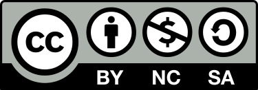

# What is this repository?
This is a german 6-part university lecture called 'Generative KI'. This repository contains the slides for lectures 1 through 4 and 6. 
Lecture 5 has been contributed and can be found here: [Generative KI - Lecture 5](https://github.com/AI-for-Business/Vorlesung-Generative-KI-Einheit-5).
The second half of the semester has been guest lectures. This repository also contains exercises, solutions, and an exam.

# What can I use it for?
Use the material to hold a lecture on 'Generative AI', or use it to complement your own materiel.

# What do I need in order to use it?
No specific hard- or software is required. No licenses are required. You need to be able to handle JPG, PDF, and
CSV files.

# Copyright / License
This work is licensed under a Creative Commons Attribution 4.0 International License (CC BY-NC-SA 4.0).

 
As such:

### You are free to:
* Share — copy and redistribute the material in any medium or format
* Adapt — remix, transform, and build upon the material
* The licensor cannot revoke these freedoms as long as you follow the license terms.

### Under the following terms:
* Attribution — You must give appropriate credit , provide a link to the license, and indicate if changes were made . You may do so in any reasonable manner, but not in any way that suggests the licensor endorses you or your use.
* NonCommercial — You may not use the material for commercial purposes .
* ShareAlike — If you remix, transform, or build upon the material, you must distribute your contributions under the same license as the original.

# Authors, Citation
Author: [Project ABBA](https://abba-project.de/about-us/)

Cite as:\
*Lecture "Generative KI" by Project ABBA, licensed under
[CC-BY-NC-SA](https://creativecommons.org/licenses/by-nc-sa/4.0/legalcode.txt),
via https://github.com/AI-for-Business/Vorlesung-Generative-KI*

# DOI - Code

# Contact / About us
* You can find all of our repositories [here](https://github.com/orgs/AI-for-Business/repositories).
* You can find the homepage of the project ABBA: **A**I for **B**usiness | **B**usiness for **A**I
[here](https://abba-project.de/).
* You can contact the authors by sending us an [email](mailto:abba-services@fim-rc.de).
